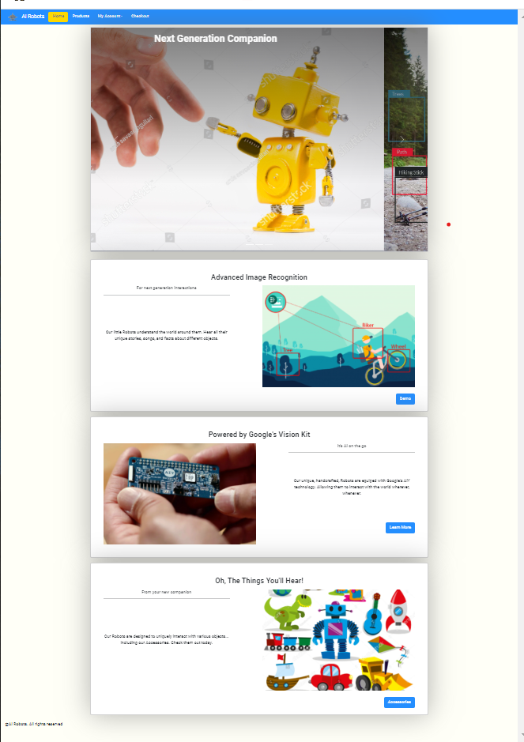
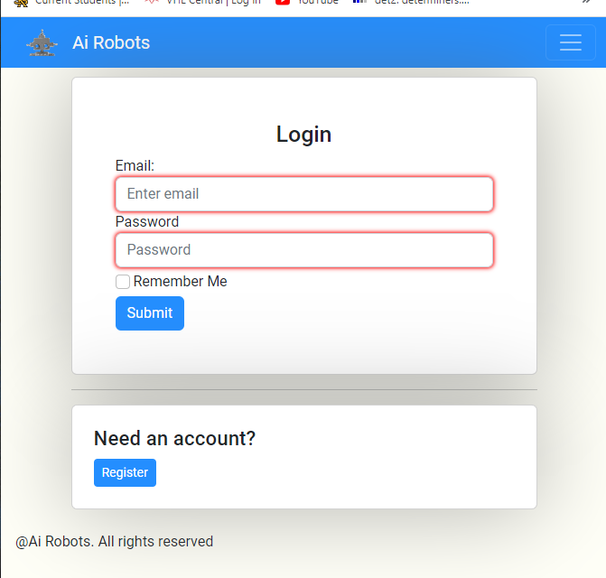
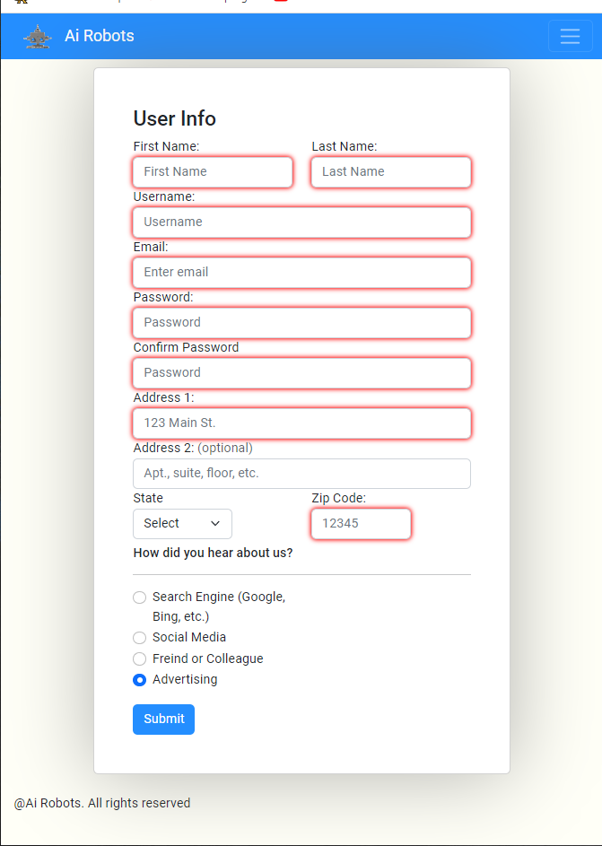
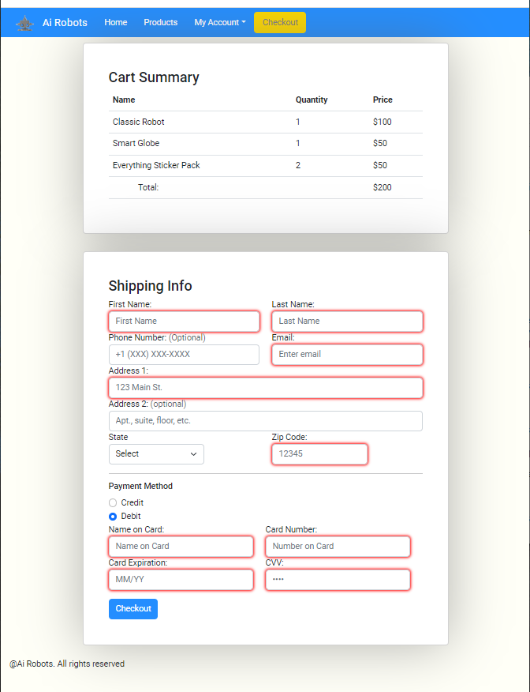
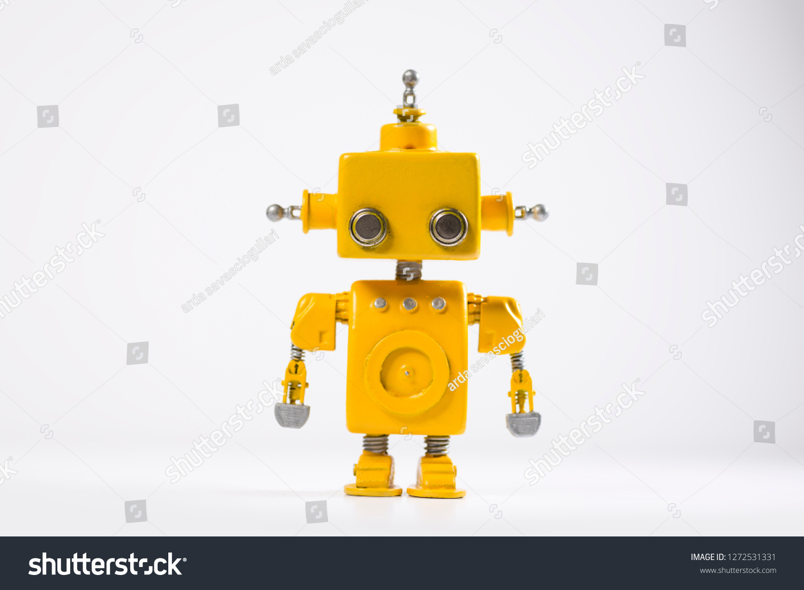

# e-commerce-website1
Capstone 1. 
Building my first e-commerce website.

**_Purpose_**
To sell a collection of fictional toy robots, with image recognition abilities. These fake robots would use AI to identify various objects in their environments, then perform predetermined actions depending on the toy model and object identified. The predetermined actions range from telling a short story, generating a song, or communicating a fact.

**_Page Images_**
Main Page:

Products

Login

Registration

Checkout

**_Interesting HTML/CSS_**
One thing I've learned during this project is that Bootstrap cards are magical. Below is a snippet of one of the first cards I made:

<!-- 

            

              
              

                <h5 class="card-title">Storybook Robot</h5>
                

                  Our classic handmade Robot in an iconic yellow body. Tells
                  stories based on what it sees.
                

              

              

                <a href="#" class="btn">Add to Cart</a>
              

            

          
 -->

The card follows a standard image/text format. It, also, has a nonfunctional button in the footer. Perhaps the only interesting part of this snippet is that I set the card height equal to the column height. Since the column height seems to be influenced by the tallest object, all cards on the same row would be the same height.

**_Navigation_**
Navigation is largely handled by the navbar at the top of each page. The nav bar collapses when below a medium breakpoint and is expanded otherwise. It also features a dropdown menu for the "My Account" section that can take the user to the login and registration pages.

There are also a number of buttons that will take the user to various locations. The login page contains a button that will take the user to the registration page. Index.html contains three navigation buttons: one that takes the user to Google's DIY page (Google's AIY inspired the robot idea), another button navigates to the accessories section of the products page, and the last button will navigate to the site's Demo page(not yet implemented.)

**_Nonfunctional elements_**
The site is still very much a work in progress and is missing several features:

-The add to cart buttons on the products page do nothing.
-The checkout button on the checkout page does not work.
-The submit buttons on all froms also do nothing.
-The Demo page has not been implemented, and the demo page button(on main page) does nothing.

**_Layout and Styling_**
The site is largely organized, and styled, with cards. Card shadows and a simple, off-white, background were used to, hopefully, give the site a "clean" look and feel. This, idealy, helps emphasize the robot theme. Colors were limited to actual page elements to, hopefully, keep the site from being too drab.
